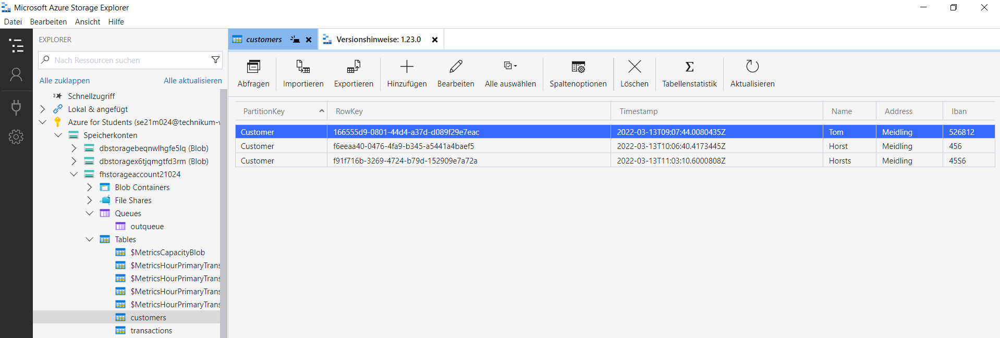
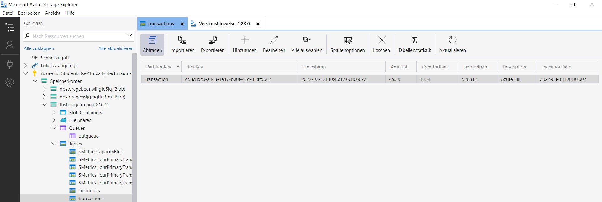
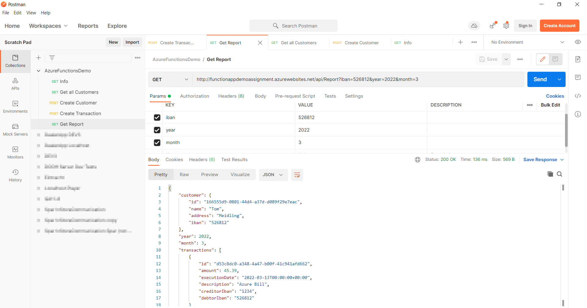

## Software Frameworks

## Assignment 2: Serverless

## Author: se21m024

 
 

# Summary

This is a .NET 6 Azure Functions demo project. 

# Repository

Please clone the following repository:
 
https://github.com/se21m024/AzureFunctionsDemo
 

# Hosting

The function app is hosted in Azure and has its root path here: 
http://functionappdemoassignment.azurewebsites.net/  
The data is persited in two Azure tables.

# Functions

1. Info
   GET http://functionappdemoassignment.azurewebsites.net/api/Info
   Returns basic information about the project.

2. Create Customer
   POST http://functionappdemoassignment.azurewebsites.net/api/Customer  
   Creates a new customer if no customer with the provided name or IBAN already exists.

3. Get Customers
   GET http://functionappdemoassignment.azurewebsites.net/api/Customers
   Returns all customers.

4. Create Transaction
   POST http://functionappdemoassignment.azurewebsites.net/api/Transaction
   Creates a new transaction (it is not necessary that customers exist for the given IBANs because they could be customers of another bank).

5. Get Report
   GET http://functionappdemoassignment.azurewebsites.net/api/Report?iban=526812&year=2022&month=3
   Returns all transactions of a given IBAN an month, if a customer is known for the given IBAN.

# Persistence

The customers and transactions are presisted in Azure tables:

CustomersTable

TransactionsTable

# Testing

To iteract with the functions, it is the easiest to import the Postman file included in the repository.

